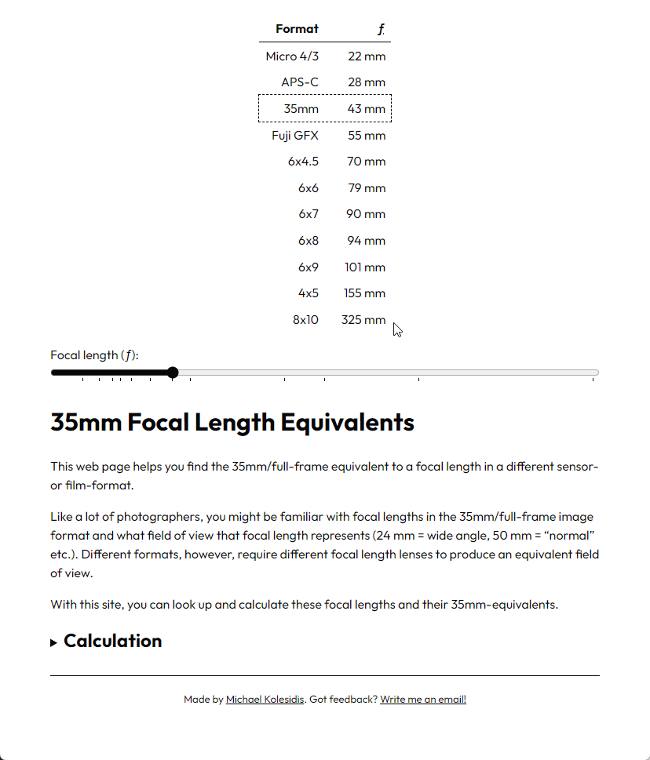

# Focal Length Equivalents

This web application helps you find the 35mm/full-frame equivalent of a focal length in a different sensor or film format.

Like many photographers, you might be familiar with focal lengths in the 35mm/full-frame image format and the field of view that these focal lengths represent (e.g., 24 mm = wide angle, 50 mm = “normal,” etc.). However, different formats require different focal lengths to produce an equivalent field of view.

With this application, you can look up and calculate these focal lengths and their 35mm equivalents.

## License

Copyright (c) 2017 Michael Kolesidis 
Licensed under the [GNU Affero General Public License v3.0](https://www.gnu.org/licenses/agpl-3.0.html).
